## Hey, I'm PowerUserZ 👋

When something on my computer annoys me twice, I build an app for it. Then I give it away.

I pair program with Claude Code, Codex and Cursor, which means I also hit their usage limits. So yes, I built an app for that too.

## 📊 Status report

## 🖥️ Where I code

## 🛠️ Side effects of being annoyed

- **[OpenTokenUsage](https://github.com/PowerUserZ/OpenTokenUsage)**: my AI coding limits, next to the Windows clock
- **[SpeedReader](https://play.google.com/store/apps/details?id=com.splusapps.speedreader)**: an Android app that shows one word at a time, so the reading list finally shrinks
- **[wsl-clipboard-png-bridge](https://github.com/PowerUserZ/wsl-clipboard-png-bridge)**: the reason my screenshots paste into Claude Code on WSL

## 🐍 Hungry for commits

<picture>
  <source media="(prefers-color-scheme: dark)" srcset="https://raw.githubusercontent.com/PowerUserZ/PowerUserZ/output/snake-dark.svg">
  
</picture>

## ☕ Fuel

Everything above runs on coffee. If one of my tools saved you time, you can top it up:

More at [poweruserz.dev](https://poweruserz.dev)
