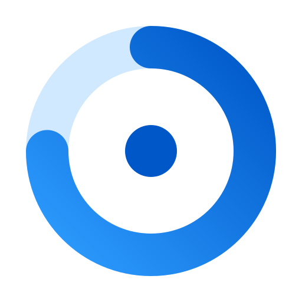
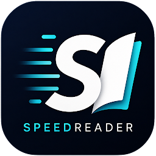

<a href="https://poweruserz.dev"></a>

## Hey, I'm PowerUserZ 👋

I'm an independent developer building small, focused apps for Windows 11, WSL and Android. Each one started as a problem in my own day: AI coding limits I kept running into, screenshots that wouldn't paste into WSL, and a reading list that kept growing.

I code with Claude Code, Codex and Cursor every day, so a lot of what I make smooths out that workflow.

## Apps I built



### [OpenTokenUsage](https://github.com/PowerUserZ/OpenTokenUsage)

Every AI coding limit, next to your Windows 11 clock. Session and weekly limits, resets, pace and alerts for Claude, Codex, Cursor, Copilot and 13 more.

[](https://github.com/PowerUserZ/OpenTokenUsage/stargazers)
[](https://github.com/PowerUserZ/OpenTokenUsage/releases/latest)
[](https://opentokenusage.app)

```powershell
winget install PowerUserZ.OpenTokenUsage
```



### [SpeedReader](https://play.google.com/store/apps/details?id=com.splusapps.speedreader)

Read one word at a time, and read faster. RSVP reading with a focus point, smart pauses at punctuation, TXT, PDF and EPUB import, and stats. No account, no tracking, no ads.

[](https://play.google.com/store/apps/details?id=com.splusapps.speedreader)
[](https://play.google.com/store/apps/details?id=com.splusapps.speedreader)


### [wsl-clipboard-png-bridge](https://github.com/PowerUserZ/wsl-clipboard-png-bridge)

Paste Windows screenshots into Claude Code on WSL. A tiny Bash daemon turns the BMP that <kbd>Win</kbd> <kbd>Shift</kbd> <kbd>S</kbd> leaves on the clipboard into the PNG Claude Code expects.

[](https://github.com/PowerUserZ/wsl-clipboard-png-bridge/stargazers)
[](https://github.com/PowerUserZ/wsl-clipboard-png-bridge/tags)
[](https://github.com/PowerUserZ/wsl-clipboard-png-bridge/actions/workflows/shellcheck.yml)

## What I build with


## Support my work

My tools are free, and most are open source. If one of them saved you time, a coffee keeps the updates coming.

<a href="https://www.buymeacoffee.com/PowerUserZ" target="_blank"></a>

## Find me

- Website: [poweruserz.dev](https://poweruserz.dev)
- Buy Me a Coffee: [buymeacoffee.com/PowerUserZ](https://www.buymeacoffee.com/PowerUserZ)
- Found a bug or have an idea? Open an issue on the app's repo.
